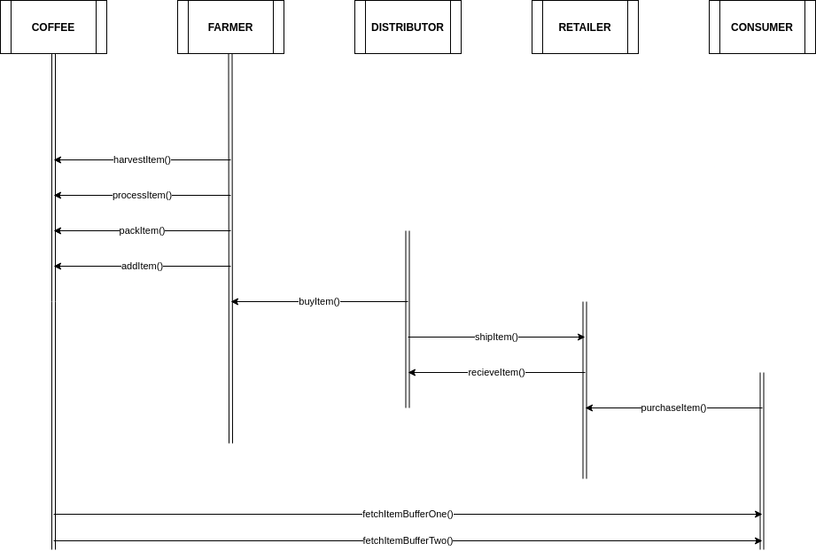
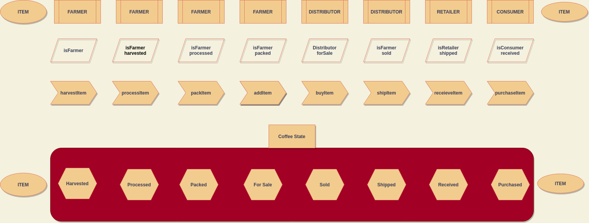
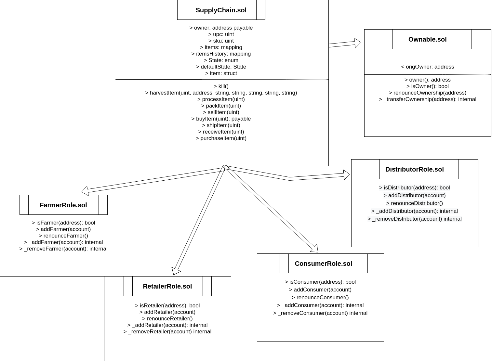

# Project 6B Supply Chain

## Truffle Version
>
    Truffle v5.1.46 
>

## Node Version
>
    node v8.11.3
>

## web3 Version
>
    web3@1.3.0
>

## Contract Address
>
   0x27D8D15CbC94527cAdf5eC14B69519aE23288B95
>

## Requirement 1: Project write-up - UML

### Activity Diagram


### Sequence Diagram


### State Diagram


### Class Diagram (Data Model)


## Requirement 2: Project write-up - Libraries
In this dApp I used a library called Roles, which allowed me to better organize the whole AccessControl situations in my Smart Contracts.

## Requirement 3: Project write-up - IPFS
No IFPS was used in this project. 

# Supply chain & data auditing

This repository containts an Ethereum DApp that demonstrates a Supply Chain flow between a Seller and Buyer. The user story is similar to any commonly used supply chain process. A Seller can add items to the inventory system stored in the blockchain. A Buyer can purchase such items from the inventory system. Additionally a Seller can mark an item as Shipped, and similarly a Buyer can mark an item as Received.

The DApp User Interface when running should look like...


## Getting Started

These instructions will get you a copy of the project up and running on your local machine for development and testing purposes. See deployment for notes on how to deploy the project on a live system.

### Prerequisites

Please make sure you've already installed ganache-cli, Truffle and enabled MetaMask extension in your browser.

### Installing

A step by step series of examples that tell you have to get a development env running

Clone this repository:

```
git clone https://github.com/udacity/nd1309/tree/master/course-5/project-6
```

Change directory to ```project-6``` folder and install all requisite npm packages (as listed in ```package.json```):

```
cd project-6
npm install
```

Launch Ganache:

```
ganache-cli -m "spirit supply whale amount human item harsh scare congress discover talent hamster"
```

In a separate terminal window, Compile smart contracts:

```
truffle compile
```

This will create the smart contract artifacts in folder ```build\contracts```.

Migrate smart contracts to the locally running blockchain, ganache-cli:

```
truffle migrate
```

Test smart contracts:

```
truffle test
```

All 10 tests should pass.

In a separate terminal window, launch the DApp:

```
npm run dev
```